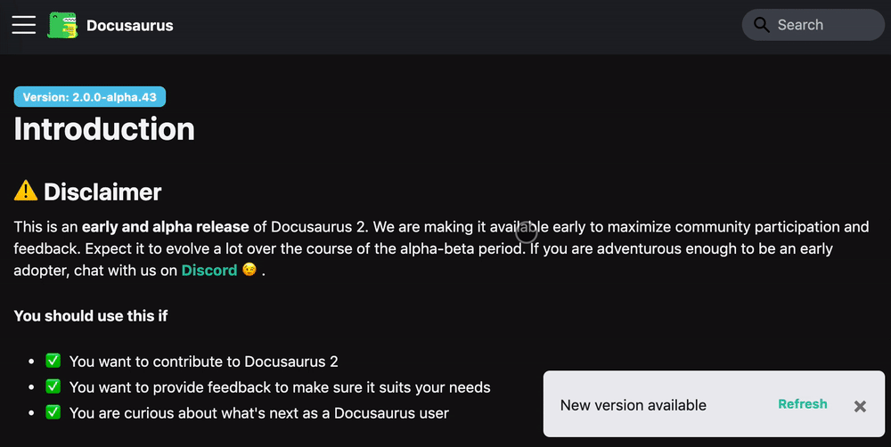

# `@docusaurus/plugin-pwa`

Docusaurus Plugin to add PWA support using [Workbox](https://developers.google.com/web/tools/workbox). This plugin generates a [Service Worker](https://developers.google.com/web/fundamentals/primers/service-workers) in production and allows you to create fully PWA-compliant documentation site with offline and installation support.

## Installation

```sh
yarn add @docusaurus/plugin-pwa
```

Modify your `docusaurus.config.js`

```js
module.exports = {
  plugins: [
    [
      '@docusaurus/plugin-pwa'
      {
        // Additional configuration options to pass to `workbox.injectManifest()`
        injectManifestConfig: {},
        // Header tags to inject in HTML for PWA compliance
        pwaHead: [
          {
            tagName: 'link',
            rel: 'icon',
            href: '/img/docusaurus.png',
          },
          {
            tagName: 'link',
            rel: 'manifest',
            href: '/manifest.json',
          },
          {
            tagName: 'meta',
            name: 'theme-color',
            content: 'rgb(37, 194, 160)',
          },
        ],
        // Custom service worker code to run after precache manifest is registered
        swCustom: path.resolve(__dirname, 'src/sw.js'),
        // File added before Docusaurus entry to register service worker before app runs
        swRegister: path.resolve(__dirname, 'src/registerSw.js'),
      },
    ],
  ],
}
```

## Progressive Web App

Having a service worker installed is not enough to make your application a PWA. You'll need to at least include a [Web App Manifest](https://developer.mozilla.org/en-US/docs/Web/Manifest) and have the correct tags in `<head>` ([Options > pwaHead](#pwahead)).

After deployment, you can use [Lighthouse](https://developers.google.com/web/tools/lighthouse) to run an audit on your site.

For a more exhaustive list of what it takes for your site to be PWA, refer to the [PWA Checklist](https://developers.google.com/web/progressive-web-apps/checklist)

## Precaching

> ### [What is Precaching?](https://developers.google.com/web/tools/workbox/modules/workbox-precaching)
>
> One feature of service workers is the ability to save a set of files to the cache when the service worker is installing. This is often referred to as "precaching", since you are caching content ahead of the service worker being used.
>
> The main reason for doing this is that it gives developers control over the cache, meaning they can determine when and how long a file is cached as well as serve it to the browser without going to the network, meaning it can be used to create web apps that work offline.
>
> Workbox takes a lot of the heavy lifting out of precaching by simplifying the API and ensuring assets are downloaded efficiently.

Precaching happens dynamically and is only used when the user is visiting the site from a mobile device (<= 940px), has [reduced data usage](https://developer.mozilla.org/en-US/docs/Web/API/NetworkInformation/saveData), or if they explicitly install it as an application.

After the site has been precached, the service worker will serve cached responses for later visits. When a new build is deployed along with a new service worker, the new one will begin installing and eventually move to a waiting state. During this waiting state, a reload popup will show and ask the user to reload the page for new content. Until the user either clears the application cache or clicks the `Refresh` button on the popup, the service worker will continue serving the old content.

## Options

### `injectManifestConfig`

- Type: `InjectManifestOptions`

[Workbox options](https://developers.google.com/web/tools/workbox/reference-docs/latest/module-workbox-build#.injectManifest) to pass to `workbox.injectManifest()`

```js
module.exports = {
  plugins: [
    [
      '@docusaurus/plugin-pwa'
      {
        manifestTransforms: [...],
        modifyURLPrefix: {...},
        ...
      },
    ],
  ],
}
```

### `popup`

- Type: `string`
- Default: `'@theme/PwaReloadPopup'`

Module path to reload popup component. This popup is rendered when a new service worker is waiting to be installed. Passing in an empty string `''` will disable the popup, but this is not recommended because then users won't have a way to get up-to-date content.

A custom component can be used as long as it accepts `onRefresh` as a prop. The `onRefresh` callback should be called when a `Refresh` button is clicked. This will tell the service worker to install the waiting service worker and reload the page.

```ts
interface PwaReloadPopupProps {
  onRefresh: () => void;
}
```

The default theme includes an implementation for the reload popup and uses [Infima Alerts](https://facebookincubator.github.io/infima/docs/components/alert).



### `pwaHead`

- Type: `Array<{ tagName: string, [key: string]: string }>`
- Default: `[]`

Array of objects containing `tagName` and key-value pairs for attributes to inject into the `<head>` tag. Technically you can inject any head tag through this, but it's ideally used for tags to make your site PWA compliant. Here's a list of tag to make your app fully compliant:

```js
module.exports = {
  plugins: [
    [
      '@docusaurus/plugin-pwa'
      {
        pwaHead: [
          {
            tagName: 'link',
            rel: 'icon',
            href: '/img/docusaurus.png',
          },
          {
            tagName: 'link',
            rel: 'manifest',
            href: '/manifest.json',
          },
          {
            tagName: 'meta',
            name: 'theme-color',
            content: 'rgb(37, 194, 160)',
          },
          {
            tagName: 'meta',
            name: 'apple-mobile-web-app-capable',
            content: 'yes',
          },
          {
            tagName: 'meta',
            name: 'apple-mobile-web-app-status-bar-style',
            content: '#000',
          },
          {
            tagName: 'link',
            rel: 'apple-touch-icon',
            href: '/img/docusaurus.png',
          },
          {
            tagName: 'link',
            rel: 'mask-icon',
            href: '/img/docusaurus.svg',
            color: 'rgb(37, 194, 160)',
          },
          {
            tagName: 'meta',
            name: 'msapplication-TileImage',
            content: '/img/docusaurus.png',
          },
          {
            tagName: 'meta',
            name: 'msapplication-TileColor',
            content: '#000',
          },
        ],
      },
    ],
  ],
}
```

### `swCustom`

- Type: `string`
- Default: `''`

Module to import and run after the precache manifest is registered. Useful for additional Workbox rules. For example, to cache files from external routes:

```js
import {registerRoute} from 'workbox-routing';
import {StaleWhileRevalidate} from 'workbox-strategies';

export default function customSW() {
  // Cache responses from external resources
  registerRoute((context) => {
    return [
      /graph\.facebook\.com\/.*\/picture/,
      /netlify\.com\/img/,
      /avatars1\.githubusercontent/,
    ].some((regex) => context.url.href.match(regex));
  }, new StaleWhileRevalidate());
}
```

The module should have a `default` export and it should be a function.

### `swRegister`

- Type: `string | boolean`
- Default: `'docusaurus-plugin-pwa/src/registerSW.js'`

Adds an entry before the Docusaurus app so that registration can happen before the app runs. The default `registerSW.js` file is enough for simple registration.

Passing an empty string `''` or `false` will disable registration entirely.
