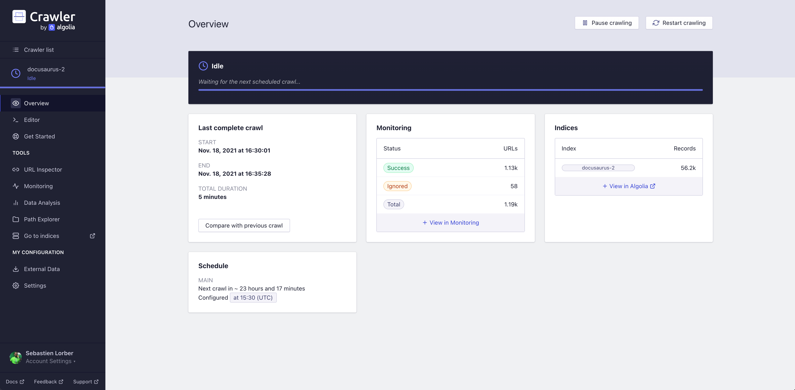
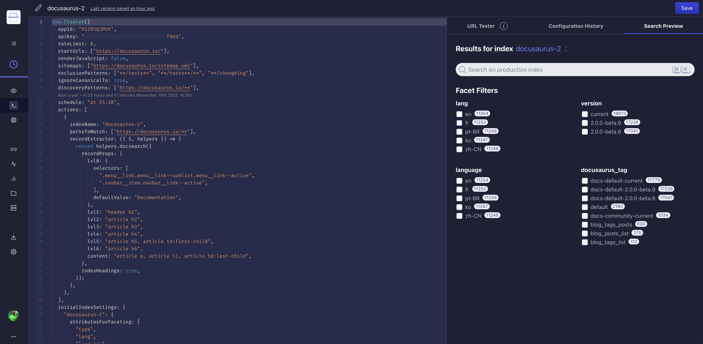
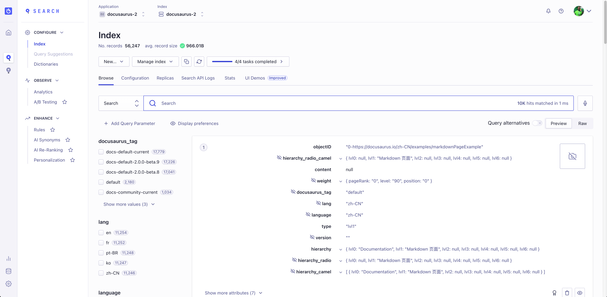
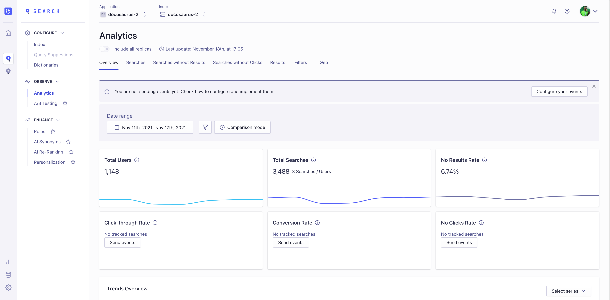

[DocSearch](https://docsearch.algolia.com/) is migrating to a new, more powerful system, which gives users their own Algolia application and new credentials.

Docusaurus site owners should upgrade their configuration with [their new credentials](#im-using-docusaurus-and-docsearch-can-i-migrate) **by February 1, 2022**, existing search indexes will be frozen and become read-only after this date.

<!--truncate-->

## Upgrading your Docusaurus site

In the next few weeks, Docusaurus site owners will receive an email inviting them to join an Algolia application.

This email will include a new `appId` and `apiKey` to use in your Docusaurus configuration.

The only things you have to do:

- Join the Algolia application (eventually creating a new Algolia account)
- Update your site configuration.

```js title="docusaurus.config.js"
const config = {
  themeConfig: {
    algolia: {
      // highlight-start
      appId: '<NEW_APP_ID>',
      apiKey: '<NEW_API_KEY>',
      // highlight-end
    },
  },
};

module.exports = config;
```

:::info

`appId` is now **required**.

These keys are not secrets and can be added to your Git repository.

:::

## DocSearch has a new home!

### What is DocSearch?

[DocSearch](https://docsearch.algolia.com/) is a program created by [Algolia](http://algolia.com/), which offers search to technical documentation of Open Source projects and technical blogs **for free**.

You can [read more here](https://docsearch.algolia.com/docs/what-is-docsearch/), and [apply](https://docsearch.algolia.com/apply) if you'd like to give it a try!

## What is this migration about?

### Motivations

With the upcoming stable release of [DocSearch UI](https://docsearch.algolia.com/docs/DocSearch-v3), we wanted to go further and provide better tooling for our users to improve their search, but also leverage the full potential of Algolia.

### What's new?

DocSearch now leverages the [Algolia Crawler](https://www.algolia.com/products/search-and-discovery/crawler/), which includes a web interface that will allow you to:

- Start, schedule and monitor your crawls
- Edit your config file from a live editor
- Test your results with DocSearch v3





But also, more Algolia features in **your own Algolia app**:

- Team management
- Browse and see how your records are indexed in Algolia
- Try other Algolia features with free trials





And of course, **a lot more, for free**.

## FAQ

### I'm using Docusaurus and DocSearch, can I migrate?

At the time we are writing this, we are still at an early stage of the migration. We are doing small batches every week but will increase the load shortly, so please be patient and keep an eye out in your mailbox, you'll be contacted as soon as your Algolia app is ready!

### Where can I read more about this?

We wrote a small [migration guide](https://docsearch.algolia.com/docs/migrating-from-legacy) but you'll have more detailed information in the migration email.

### I received the migration email but the invite expired

Please contact us via either [email](mailto:docsearch@algolia.com) or [DocSearch's Discord](https://discord.gg/bRTacwYrfX) or on [Docusaurus's Discord #algolia channel](https://discordapp.com/invite/docusaurus)

### I have feedbacks!

For any feedback regarding our documentation or the DocSearch UI component, you can open an issue [on our GitHub repository](https://github.com/algolia/docsearch/issues), but also contact us via the methods above.

### Can I still run my own DocSearch instance?

In favor of the new infrastructure and DocSearch v3, we will no longer maintain our beloved [DocSearch scraper](https://github.com/algolia/docsearch-scraper) and [DocSearch v2](https://github.com/algolia/docsearch/tree/master), but the repositories will still be available and open to pull requests.

The previous documentation (now called `legacy`) remains available as well as our [`run your own`](https://docsearch.algolia.com/docs/legacy/run-your-own) guide.
